```mermaid {scale: 0.4}
graph LR
    Start["🧑 User: 'Plan a 4-day trip to Tokyo'<br/>with flights, hotel, car, 2 dinners"]
    
    Start --> Task1[Flight Search]
    Start --> Task2[Hotel Search]
    Start --> Task3[Car Rental]
    Start --> Task4[Restaurant Reservations]
    
    Task1 --> F1[United Direct]
    Task1 --> F2[Alaska + Partner]
    Task1 --> F3[Google Flights Aggregator]
    Task1 --> F4[Kayak Metasearch]
    Task1 --> F5[Expedia Bundle]
    Task1 --> F6[Points Redemption]
    
    Task2 --> H1[Marriott Bonvoy]
    Task2 --> H2[Hilton Honors]
    Task2 --> H3[Airbnb]
    Task2 --> H4[Booking.com]
    Task2 --> H5[Hotels.com]
    Task2 --> H6[Expedia Bundle]
    Task2 --> H7[Trivago Comparison]
    
    Task3 --> C1[Hertz]
    Task3 --> C2[Enterprise]
    Task3 --> C3[Turo P2P]
    Task3 --> C4[Airport Shuttle]
    Task3 --> C5[Uber/Lyft Only]
    
    Task4 --> D1[OpenTable]
    Task4 --> D2[Resy]
    Task4 --> D3[Yelp]
    Task4 --> D4[Direct Restaurant]
    Task4 --> D5[Google Maps]
    
    F1 -.-> Coord{Orchestration<br/>Layer}
    F2 -.-> Coord
    F3 -.-> Coord
    F4 -.-> Coord
    F5 -.-> Coord
    F6 -.-> Coord
    H1 -.-> Coord
    H2 -.-> Coord
    H3 -.-> Coord
    H4 -.-> Coord
    H5 -.-> Coord
    H6 -.-> Coord
    H7 -.-> Coord
    C1 -.-> Coord
    C2 -.-> Coord
    C3 -.-> Coord
    C4 -.-> Coord
    C5 -.-> Coord
    D1 -.-> Coord
    D2 -.-> Coord
    D3 -.-> Coord
    D4 -.-> Coord
    D5 -.-> Coord
    
    Coord --> Result["📋 Complete Itinerary"]
    
    style Start fill:#4A90E2,stroke:#333,stroke-width:4px,color:#fff
    style Coord fill:#E74C3C,stroke:#333,stroke-width:4px,color:#fff
    style Result fill:#27AE60,stroke:#333,stroke-width:4px,color:#fff
    style Task1 fill:#3498DB,stroke:#333,stroke-width:2px,color:#fff
    style Task2 fill:#9B59B6,stroke:#333,stroke-width:2px,color:#fff
    style Task3 fill:#F39C12,stroke:#333,stroke-width:2px,color:#fff
    style Task4 fill:#1ABC9C,stroke:#333,stroke-width:2px,color:#fff
```

# Death of agentic frameworks?

## Peter Danenberg

---
layout: image
image: ./agent-frameworks-cropped.png
backgroundSize: contain
---

---
layout: image
image: ./roblox.png
backgroundSize: contain
---

---
layout: full
---

---
layout: center
class: text-center
---

# Questions?

Thank you

